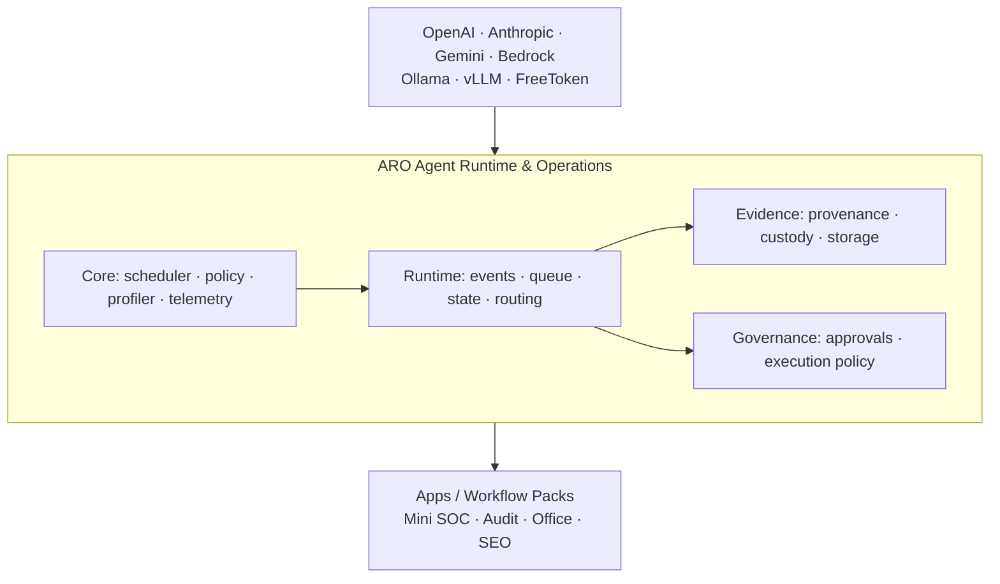

# ARO target architecture

ARO is an **Agent Runtime & Operations Platform**, not a model runtime. AI providers and inference engines are replaceable backends; ARO owns evidence-aware task execution, policy, approvals, routing, verification, and auditability.

Evidence progression is explicit: `Observation ≠ Evidence ≠ Finding ≠ Conclusion ≠ Action`. Agent activity records the inputs, outputs, policy decision, approval, action, and verification references needed to reconstruct a run.

## Dependency direction

`aro/core.py` is headless. `aro/runtime.py` wraps it for reusable lifecycle operations. CLI, HTTP dashboard/API, and a future Desktop shell call Runtime and do not own scheduling logic. Apps submit tasks and consume evidence contracts; they do not reach into provider implementations.

## Migration plan

1. Keep current scheduler, resource model, telemetry, simulator, and dashboard behavior.
2. Introduce evidence/governance/provider ports (this iteration).
3. Move Mini SOC into an app/workflow-pack contract with read-only collectors.
4. Add real node discovery and provider adapters behind the ports.
5. Add durable state, approvals, and multi-node transport only after the contracts stabilize.
