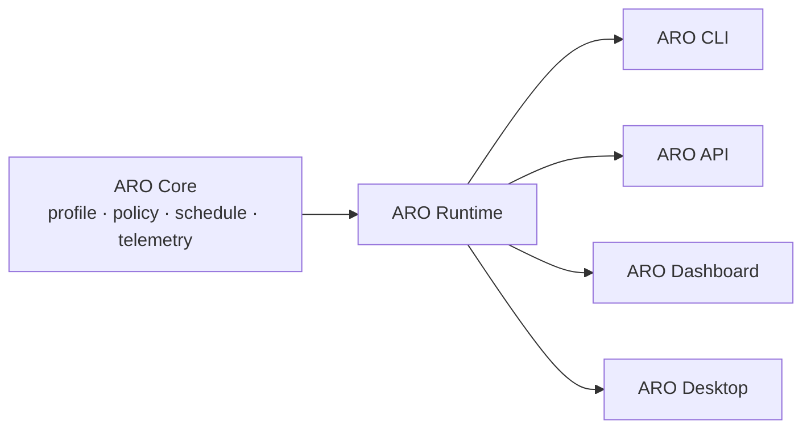
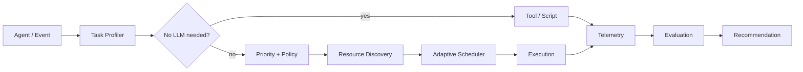

# ARO — Adaptive Resource Orchestrator

**ver392026**

> **Run many AI agents on the hardware you already own.**
>
> *Don't give every agent a GPU. Give every agent the right resource.*

ARO is a lightweight reference implementation for adaptive, policy-aware orchestration of heterogeneous resources across many AI agents. It operates at the **agent/task layer**, deciding whether a task needs an LLM at all, then routing it to the right tool, local model, node, or cloud capability.

### Product architecture

ARO Core is headless and UI-independent. A reusable Runtime exposes the same orchestration services to the CLI, API, Dashboard, and future Desktop application:



The dashboard and future desktop shell contain presentation and connection concerns only; scheduling logic remains in Core/Runtime. See [Desktop vision](docs/product/desktop-vision.md).



## Quick start

Requires Python 3.10+ and no third-party packages.

```bash
python -m aro.demo --scenario normal
python -m aro.demo --scenario incident
python -m aro.dashboard
```

Open <http://127.0.0.1:8080>. Click **Simulate Security Incident** to see watch agents detect an anomaly, incident work escalate, and lower-priority work defer. JSON API: `/api/state`.

Run tests:

```bash
python -m unittest discover -s tests -v
```

## What ARO is (and is not)

Inference engines optimize model execution and serving. ARO orchestrates agent workloads: no-LLM decisions, priority, policy, queues, contention, escalation, telemetry, and human-reviewed optimization. ARO is runtime/vendor agnostic and can later connect Ollama, llama.cpp, FreeToken, MLX, OpenAI-compatible APIs, cloud GPUs, and additional nodes without changing the core interfaces.

## Supported by 5SOffice

ARO is developed and tested as part of practical research into AI Agent infrastructure and resource-efficient automation.

**5SOffice** · Website: <https://5soffice.com.vn>

Project initiated by **Nguyễn Đăng Quang** · Supported by **5SOffice**.

## Support ARO

If ARO helps you make better use of your existing hardware, build your AI Agent lab, or reduce unnecessary compute costs, consider supporting continued development. See [SUPPORT.md](SUPPORT.md).

## Public boundary

This repository contains architecture, generic implementation, simulator code, example configuration, and synthetic data only. Never add credentials, private security configuration, real incident evidence, customer data, internal infrastructure details, or private prompts/workflows.

## Documentation

- [Architecture](docs/architecture.md)
- [Home Lab ver392026](docs/home-lab-ver392026.md)
- [FreeToken lessons and attribution](docs/research/freetoken-lessons.md)
- [Roadmap](ROADMAP.md)
- [Contributing](CONTRIBUTING.md)

## License and attribution

MIT licensed. See [LICENSE](LICENSE). FreeToken is inspiration for heterogeneous resource utilization and adaptive execution; ARO is an independent agent-level orchestration design and does not copy FreeToken source code. See the dedicated attribution note for official links and scope.
