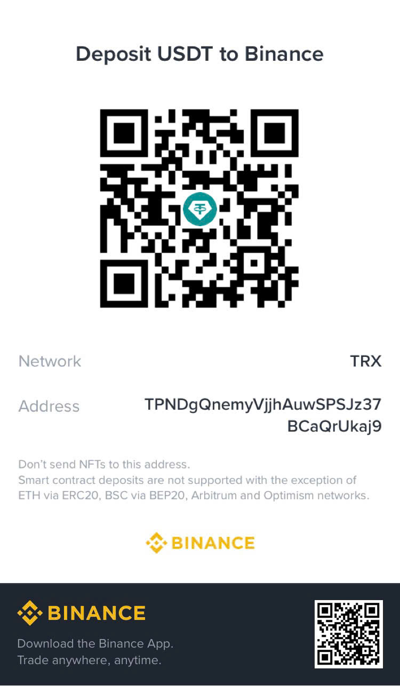

# Support the Project

If ARO helps you make better use of your existing hardware, build your AI Agent lab, or reduce unnecessary compute costs, consider supporting continued development.

Author and project attribution:

- Project initiated by Nguyễn Đăng Quang
- Supported by 5SOffice
- Website: https://5soffice.com.vn

The HQC-AI reference repository was requested as the authoritative source for any public donation details. It could not be fetched in this environment, so no donation account, wallet, QR code, or payment URL is copied or invented here. Owner review is required before publication.

Donation methods (owner: complete before publication):

### Bank transfer — Vietnam & International

- **Bank:** Shinhan Bank Vietnam
- **Account holder:** NGUYEN DANG QUANG
- **Account number:** `0944659937`
- SWIFT/BIC: `SHBKVNVX`
- **Transfer reference:** `DONATE HQC AIMS`

  

### USDT — TRON (TRC20)

- **Asset:** Tether — USDT
- **Network:** TRON — TRC20
- **Receiving address:** `TPNDgQnemyVjjhAuwSPSJz37BCaQrUkaj9`

  

> Verify the receiving address and blockchain network carefully before transferring. Cryptocurrency transactions are generally irreversible.

Your contribution helps maintain the Community Edition, improve documentation, develop practical examples, and continue sharing useful AI governance resources.

No payment account, QR code, or donation URL is intentionally invented in this repository.
