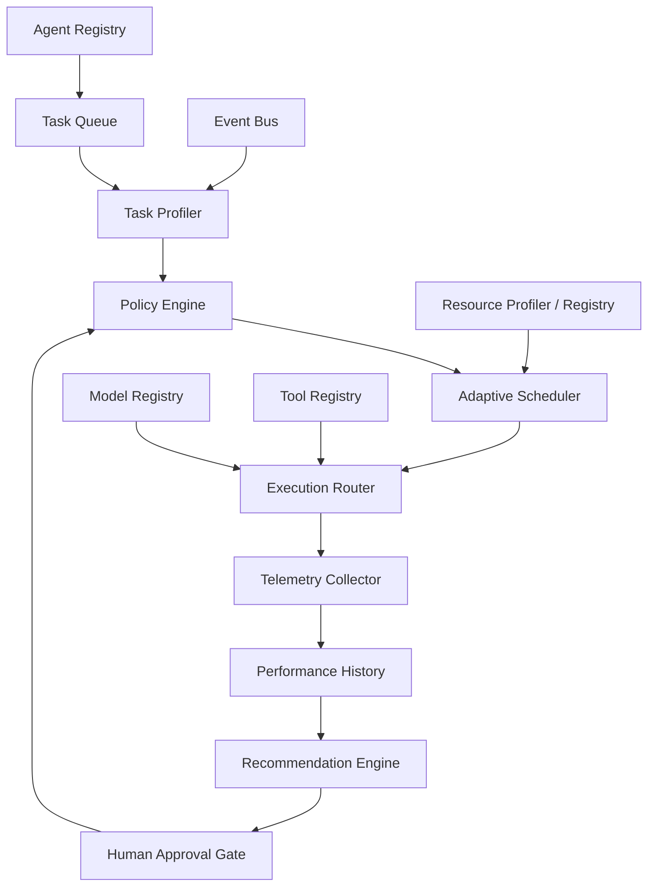
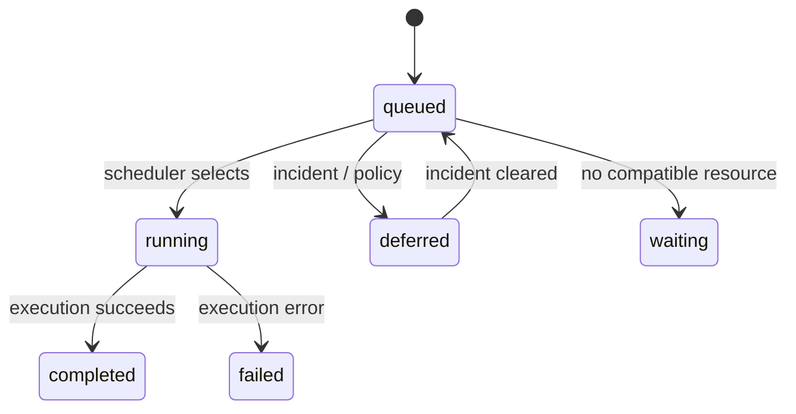
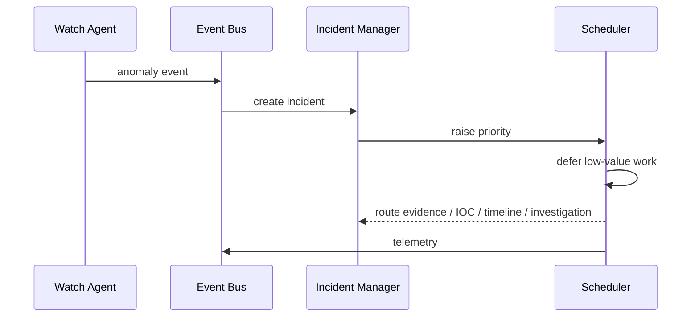

# ARO architecture

ARO keeps registries and decision interfaces separate from execution adapters. An adapter may expose a local model, API, tool, MCP service, database, vector store, or compute node as a `Resource` without changing scheduling logic.

The production-safe optimization loop is **Observe → Evaluate → Propose → Benchmark/Test → Human Approve → Promote**. ARO never silently changes production policy.

## Lifecycles

## Scheduling signals

Task type, priority, privacy, latency, reasoning, context size, expected runtime, current CPU/RAM/GPU/VRAM/I/O/network, availability, model/tool availability, history, API cost, and cloud availability are intended inputs. The demo implements a small deterministic subset and is designed for extension.
