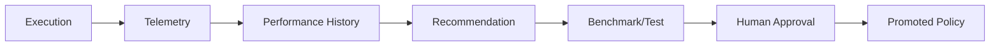

# Diagram index

The system architecture, task lifecycle, incident escalation, and Home Lab diagrams live in [architecture.md](architecture.md) and [home-lab-ver392026.md](home-lab-ver392026.md). The telemetry feedback loop is:

