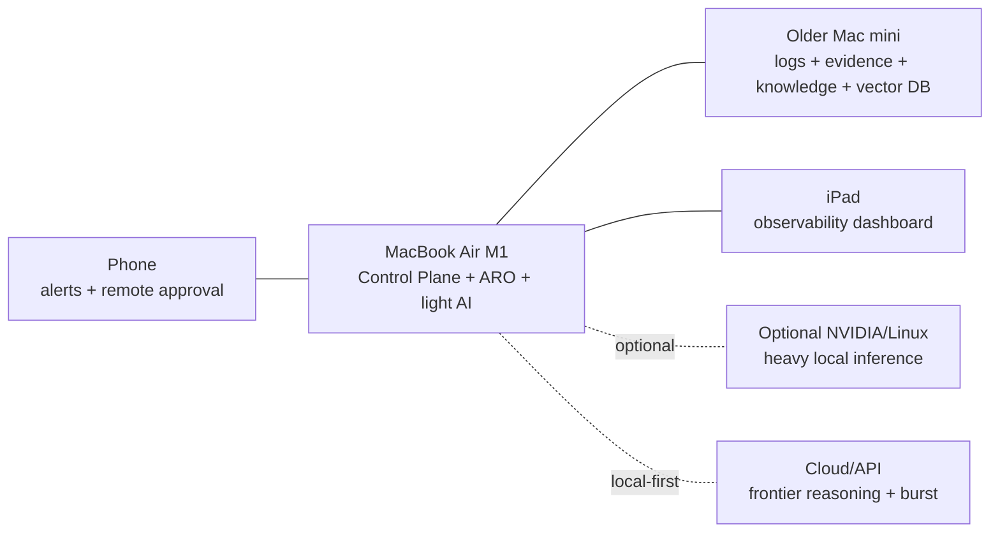

# Reference Home Lab — ver392026

This is a reference topology, not a requirement. ARO should run across one laptop, a small home lab, or a larger heterogeneous environment. Keep secrets, real evidence, and internal network details out of public configuration.
